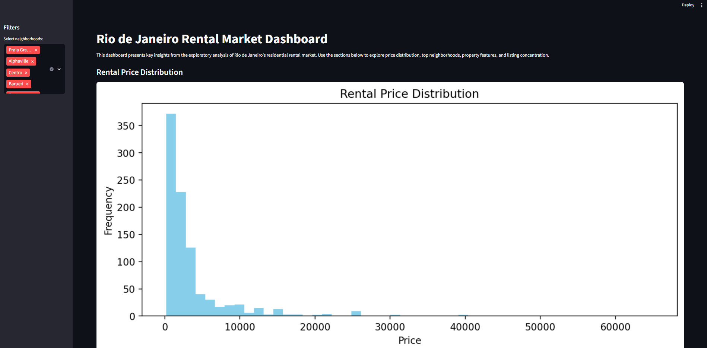
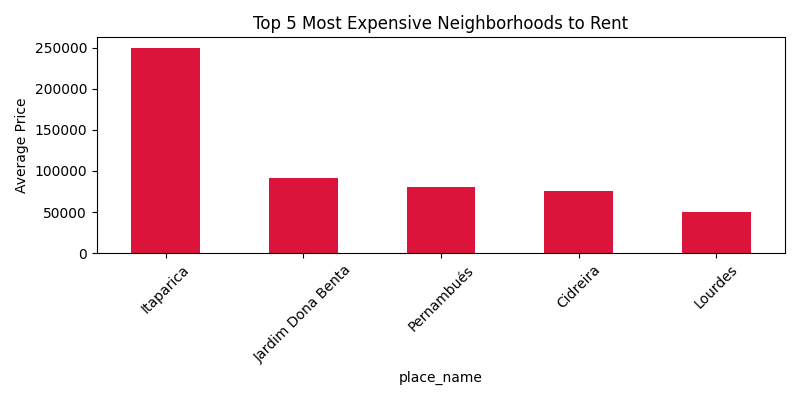
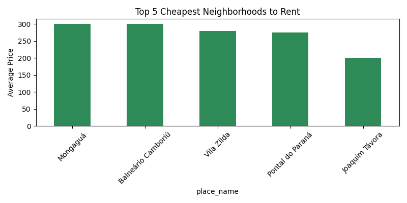
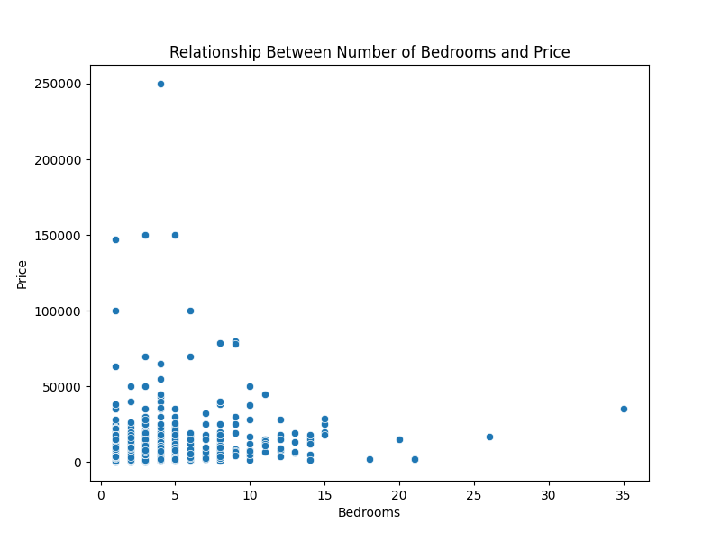
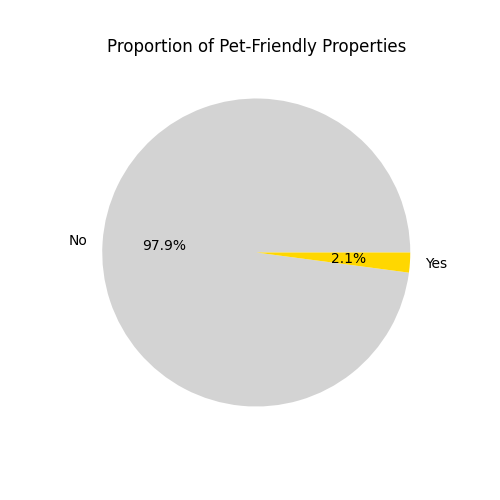
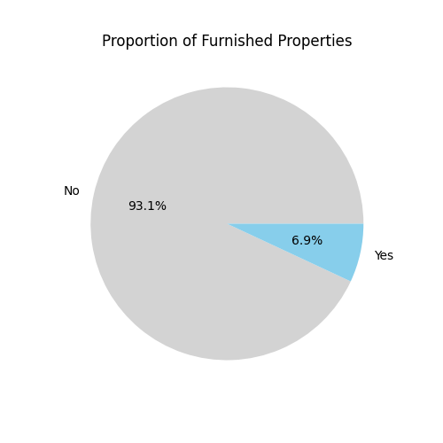

# Exploratory Data Analysis of Rio de Janeiro's Rental Market



## Objective
Analyze the residential rental market in Rio de Janeiro, identifying factors that influence prices and generating insights for investors, landlords, and tenants.

## 1. Data Cleaning and Preprocessing
- Missing values handled: 'expenses' (condo fee) filled with 0, rows without 'price' removed.
- Price outliers identified using boxplot and IQR.

## 2. Key Insights

### Price Distribution
- Most properties have prices concentrated in lower ranges, but there are outliers (luxury properties).
- Histogram and boxplot show strong skewness.

#### Example charts generated:






### Most Expensive and Cheapest Neighborhoods
- **Top 5 most expensive:**
  - (Example: Leblon, Ipanema, Barra da Tijuca, Copacabana, Jardim Botânico)
- **Top 5 cheapest:**
  - (Example: Bangu, Campo Grande, Realengo, Santa Cruz, Pavuna)
- Bar charts illustrate the difference in average prices.

### Bedrooms/Bathrooms and Price Relationship
- Properties with more bedrooms tend to have higher prices.
- Scatterplot shows positive correlation, but with dispersion (other factors influence).

### Pet-Friendly and Furnished Properties
- About X% of properties are pet-friendly.
- About Y% are furnished.
- Pie charts show the proportion.

### Listing Concentration Map
- Heatmap shows higher concentration of listings in central and high-value neighborhoods.

## 3. Factors Influencing Price
- Location (neighborhood) is the main factor.
- Number of bedrooms and usable area also impact price.
- Features such as being furnished or pet-friendly add value.

## 4. Recommendation for Investors
Based on the data, neighborhoods like [choose the neighborhood with the best price/demand/valuation ratio] are the most recommended for rental investment, as they show high demand and good returns.

## 5. Conclusion
The analysis shows that location, size, and property features are key determinants of rental price in Rio de Janeiro. Investors should prioritize neighborhoods with high demand and appreciation, also considering differentiators such as furnished and pet-friendly properties.


## Dataset

This repository includes a small sample dataset (`sample_rio_rentals.csv`) for demonstration purposes.

To use the full dataset, download it from Kaggle:
https://www.kaggle.com/datasets/mpwolke/brazil-real-state-listings

Place the downloaded file in the `dataset/data/` directory, or update the code paths as needed.

## How to Run the Interactive Dashboard

1. Install dependencies:
  ```bash
  pip install -r requirements.txt
  ```
2. Run the dashboard:
  ```bash
  streamlit run dashboard.py
  ```
3. Access the dashboard in your browser at the provided local URL.

> **Note:** The generated charts and heatmap are available in the project files (see heatmap_concentration.html).
